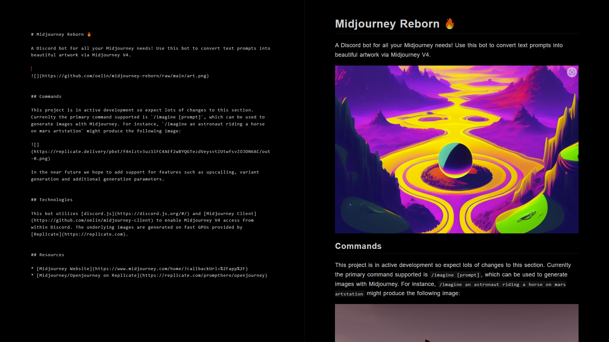

# Sable

A minimalistic markdown editor for writing in low light 😴.




## About

Sable is a simple markdown editor with zero clutter. It focuses on providing a quiet, distraction free user experience and reducing eye strain in environments with low light.


## Features

* 💻 quiet, distraction free editing.
* 🎨 syntax highlighting.
* 🔼 HTML and PDF export.

Some planned features include:

* MathJax support.
* Embedded HTML support.
* Custom colour schemes.


## Installation

```sh
$ npm i
```

To run the dev server use `npm run dev`, or `npm run build` to create a production build.
